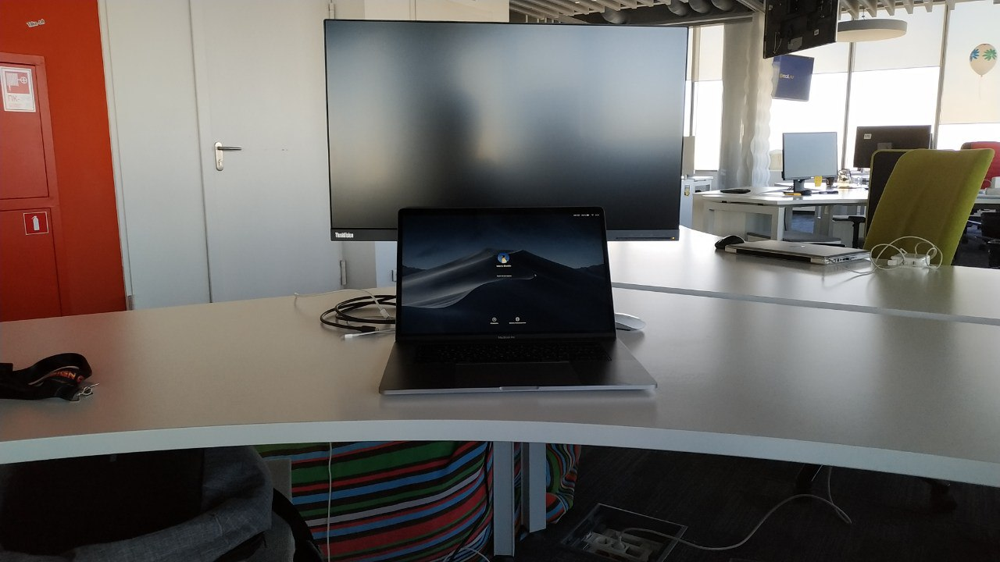

Меня зовут Валера, я дизайнер и проектировщик интерфейсов. С 2019 года я работаю в команде дизайн-системы в компании [mail.ru](https://www.mail.ru).

До этого я более трех лет занимался проектированием интерфейсов онлайн бухгалтерии в [компании Тензор](https://www.tensor.ru). За это время я сделал более ста детальных прототипов в  Axure, и учавствовал в 12 больших проектах.

В этом блоге я буду писать свои заметки. Считая себя очень творческой и разносторонней личностью мне нужно место где я буду систематизировать свои мысли. За время работы я понял что иногда приходится возвращаться к старым идеям и знаниям, но не всегда все находится под рукой. В свободное время мне интересно создавать музыку и фильмы. Я экспериментирую со звуком в своей домашней студии и иногда монтирую семейные видео.

Надеюсь вам будет интересно читать. Пишите свои комментарии мне на почту или в [twitter](https://twitter.com/fliqle). Буду рад пообщаться.

  

