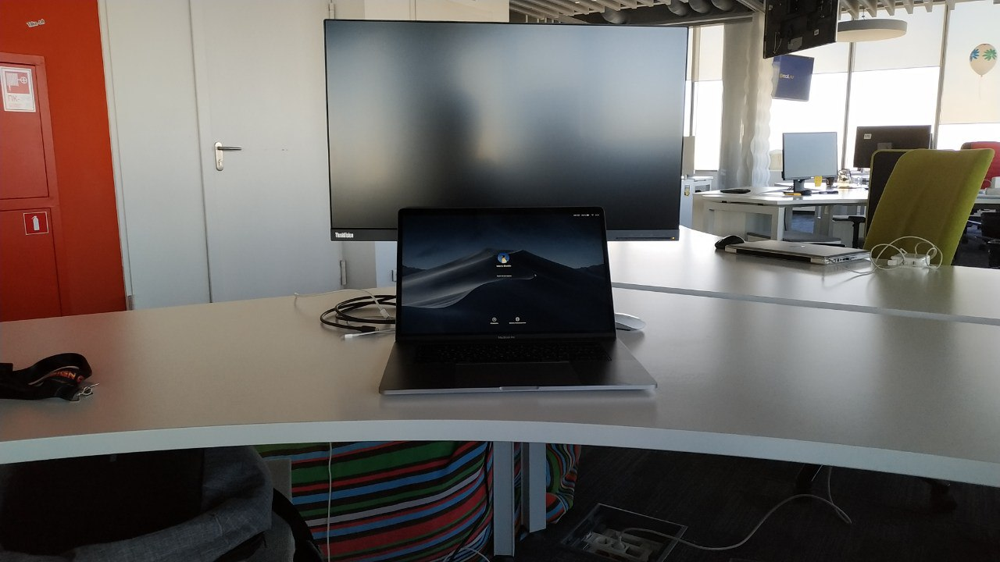

Привет, меня зовут Валерий Сироткин. Я продуктовый дизайнер и проектировщик пользовательских интерфейсов. Занимаюсь дизайном с 2009 года. Начинал с оформления афиш и обложек музыкальных дисков, потом перешел в мир web интерфейсов.

С 2016 по 2019 год я занимался созданием интерфейсов облачной бухгалтерии в [компании Тензор](https://www.tensor.ru). Я сопровождал проекты от идеи до готового продукта. Учавствовал в составлении спецификаций, взаимодействовал с разработчиками и группой тестирования.

С 2019 года я перешел на работу в крупнейшую IT компанию России mail.ru. Я помогаю в проектировании интерфейсов почты, занимаюсь общей навигацией по сервисам и дизайн системой. Так же большую часть своего времени посвящаю внедрению теории Jobs-to-be-done в процессы команды.

<div className="Image__Small">
  
</div>

В свободное время мне интересно создавать музыку и фильмы. Я экспериментирую со звуком в своей домашней студии и иногда монтирую семейные видео.

Я всегда рад новым знакомствам и если вы зашли на мой сайт, значит вас что-то заинтересовало. Напишите мне в [twitter](https://twitter.com/fliqle) или [facebook](https://facebook.com/fliqle).

## Lists

1. First ordered list item
2. Another item
3. Actual numbers don't matter, just that it's a number

- Unordered list can use asterisks

* Or minuses

- Or pluses

## Links

[I'm an inline-style link](https://www.google.com)

[I'm an inline-style link with title](https://www.google.com "Google's Homepage")

[I'm a reference-style link][arbitrary case-insensitive reference text]

[I'm a relative reference to a repository file](../blob/master/LICENSE)

[You can use numbers for reference-style link definitions][1]

Or leave it empty and use the [link text itself].

URLs and URLs in angle brackets will automatically get turned into links.
http://www.example.com or <http://www.example.com> and sometimes
example.com (but not on Github, for example).

Some text to show that the reference links can follow later.

[arbitrary case-insensitive reference text]: https://www.mozilla.org
[1]: http://slashdot.org
[link text itself]: http://www.reddit.com

## Images

<div className="Image__Small">
  
</div>

Lorem Ipsum is simply dummy text of the printing and typesetting industry. Lorem Ipsum has been the industry's standard dummy text ever since the 1500s, when an unknown printer took a galley of type and scrambled it to make a type specimen book. It has survived not only five centuries, but also the leap into electronic typesetting, remaining essentially unchanged. It was popularised in the 1960s with the release of Letraset sheets containing Lorem Ipsum passages, and more recently with desktop publishing software like Aldus PageMaker including versions of Lorem Ipsum. Lorem Ipsum is simply dummy text of the printing and typesetting industry.

## Code and Syntax Highlighting

```javascript
var s = "JavaScript syntax highlighting";
alert(s);
```

```
No language indicated, so no syntax highlighting.
But let's throw in a <b>tag</b>.
```

### JSX

```jsx
import React from "react";
import { ThemeProvider } from "theme-ui";
import theme from "./theme";

export default props => (
  <ThemeProvider theme={theme}>{props.children}</ThemeProvider>
);
```

## Blockquotes

Lorem Ipsum is simply dummy text of the printing and typesetting industry. Lorem Ipsum has been the industry's standard dummy text ever since the 1500s, when an unknown printer took a galley of type and scrambled it to make a type specimen book. It has survived not only five centuries, but also the leap into electronic typesetting, remaining essentially unchanged. It was popularised in the 1960s with the release of Letraset sheets containing.

> Blockquotes are very handy in email to emulate reply text.
> This line is part of the same quote.

Lorem Ipsum is simply dummy text of the printing and typesetting industry. Lorem Ipsum has been the industry's standard dummy text ever since the 1500s, when an unknown printer took a galley of type and scrambled it to make a type specimen book. It has survived not only five centuries, but also the leap into electronic typesetting, remaining essentially unchanged. It was popularised in the 1960s with the release of Letraset sheets containing Lorem Ipsum passages, and more recently with desktop publishing software like Aldus PageMaker including versions of Lorem Ipsum

## Horizontal Rule

Horizontal Rule

Three or more...

---

Lorem Ipsum is simply dummy text of the printing and typesetting industry. Lorem Ipsum has been the industry's standard dummy text ever since the 1500s, when an unknown printer took a galley of type and scrambled it to make a type specimen book. It has survived not only five centuries, but also the leap into electronic typesetting, remaining essentially unchanged. It was popularised in the 1960s with the release of Letraset sheets containing Lorem Ipsum passages, and more recently with desktop publishing software like Aldus PageMaker including versions of Lorem Ipsum

---

Lorem Ipsum is simply dummy text of the printing and typesetting industry. Lorem Ipsum has been the industry's standard dummy text ever since the 1500s, when an unknown printer took a galley of type and scrambled it to make a type specimen book. It has survived not only five centuries, but also the leap into electronic typesetting, remaining essentially unchanged. It was popularised in the 1960s with the release of Letraset sheets containing Lorem Ipsum passages, and more recently with desktop publishing software like Aldus PageMaker including versions of Lorem Ipsum
